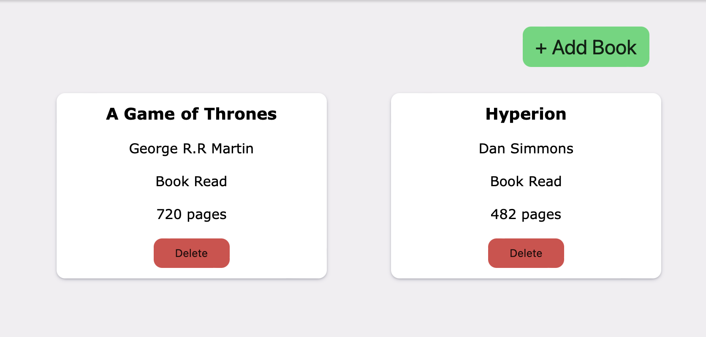

# odin-library

[Access the application here](https://benjamin-albarzendji.github.io/odin-library/)

### Description
My first forray into creating objects based on classes. The entire exercise was essentially that. The application fills no bigger purpose than creating and deleting classes. I also honed my JavaScript and CSS skills for a dynamic animated popup form to add objects. 

